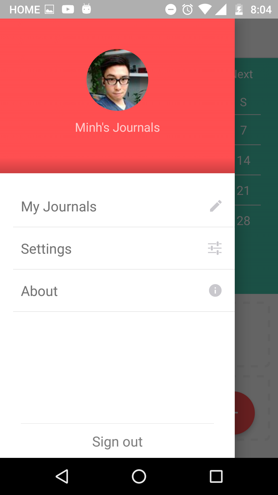

# Five Minute Journal

This is my current ongoing personal project. This project is a challenge I set for myself to build a product from scratch where I handle everything from concept to design and development.

#### Concept
The app is a simple digital version of the popular Five Minute Journal, a daily journal that helps you stay focus on the positive things in life by answering five simple questions everyday.

I came across the Five Minute Journal through Tim Ferriss's book Tools of Titans and thought I wanted to build a digital version of it for myself as well as to share with the world.

#### The tech stack
- React Native + Redux
  - I chose React Native for its use of Javascript and Redux for state management.
  - Redux provides a very predictable data flow that is perfect for a CRUD app like this.
- Firebase
  - I chose firebase because of the relatively simple data model required for the project.
  - Firebase provides many typical infrastructural features such as authentication and user account management API right out of the box which allows me to focus on building the app itself and not the infrastructure to support it.
  - Firebase also offers offline persistence so that data loaded from the server can be automatically cached in the local filesystem, greatly simplifying the development.

#### Design
Check out the many design iterations we've got so far: https://goo.gl/hoUwd1

#### Latest build
Check out the latest build off the app: https://goo.gl/AtWvzO

#### Preview Screenshots
Here are a few screenshots of the actual app currently:

 
  

<!--  -->
